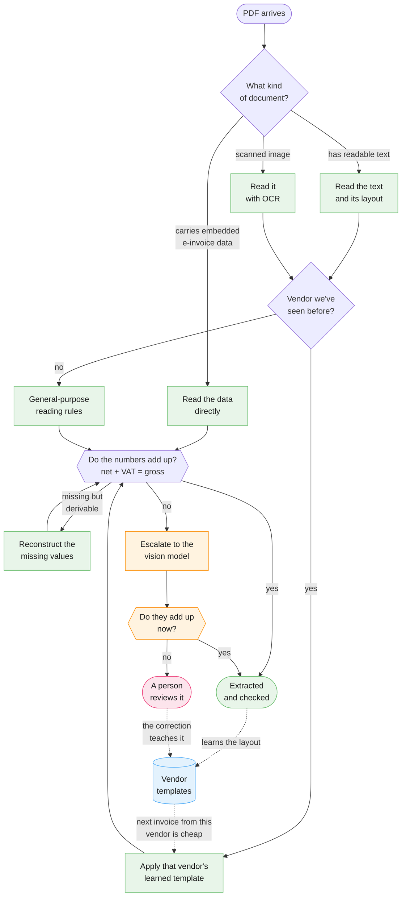

# InvEx — what it is and how it works

InvEx turns invoice PDFs into **structured, arithmetically checked data**: who billed you, when, for
what, at which VAT rate, and every line item. Documents that turn out not to be invoices come back as
readable Markdown instead of being forced into a shape they don't fit.

It is a service, not an application — you send it PDFs and read the results back over an API. There is
no user interface.

## Why it is built the way it is

There are three ways to read an invoice, and they differ in cost by orders of magnitude:

| | Cost | Speed |
| --- | --- | --- |
| **Deterministic code on a CPU** | negligible | milliseconds |
| **A vision language model on a GPU** | significant | seconds to minutes — a cold model load alone measures 1½–2½ minutes in our deployment |
| **A person** | the most expensive thing in the system | minutes, and they have to be available |

So InvEx is built as a **ladder**: always try the cheap path first, escalate only when it genuinely
cannot close the document.

The part that matters most is what happens *after* an escalation. **Every trip up the ladder teaches
the system something.** When the vision model or a human reads an invoice, InvEx records how that
vendor lays out their documents — where the invoice number sits, what they call the total, which table
column holds the quantity — and stores it as a **vendor template**. The next invoice from that vendor is
read by the cheap deterministic path.

This works because invoice volume is heavily concentrated: a small number of suppliers account for most
documents, and their layouts barely change from month to month. **The cost per document therefore falls
the longer you use it** — escalations are not failures, they are how the system learns.

## How a document flows through

Green is cheap CPU work, amber is the GPU, pink is human time, blue is the learning loop. The dotted
edges are the point of the whole design: everything expensive feeds back into widening the cheap path.

## Why you can trust the numbers

InvEx does not simply *read* an invoice — it **checks it against itself**. An invoice is heavily
over-determined arithmetically, and InvEx uses that:

- net + VAT must equal the gross total
- the line items must sum to the subtotal
- quantity × unit price must equal each line total
- German VAT rates come from a known set (19 %, 7 %, 0 %)

Two things follow. Where a number is **missing but derivable**, it is reconstructed rather than left
blank — an unprinted quantity is 1 if the unit price equals the line total, an unprinted unit price is
the line total divided by the quantity, and a single-rate document's VAT rate is inherited by its lines.
Where the numbers **contradict each other**, the document is escalated rather than quietly accepted.

That is the guarantee: extraction is accepted when the arithmetic closes, even if some values were
inferred — and when it doesn't close, a human sees it. Silent partial results are the one outcome the
design rules out.

## What comes back

Every document reaches exactly one of five end states:

| Outcome | Meaning |
| --- | --- |
| **Extracted** | A complete invoice whose arithmetic checks out. This is the goal. |
| **Not an invoice** | A letter, terms and conditions, a delivery note — returned as Markdown. |
| **Needs review** | The numbers could not be closed. A person looks at the PDF and the draft side by side; their correction becomes both the result and a new vendor template. |
| **Multiple invoices** | The file contained several invoices; each was split out and processed on its own. |
| **Failed** | The file could not be processed at all — corrupt, unreadable, or an unrecoverable error. |

Processing is **asynchronous**: sending a PDF returns immediately with a tracking id, and the result is
collected by polling. A vision-model escalation can take minutes, so consumers must be patient rather
than assume a fast answer.

## What it needs to run

A PostgreSQL database (which holds the documents, the results and the learned templates), a
**docling-serve** instance for reading page layout and performing OCR, and — only for the escalation
path — any OpenAI-compatible endpoint serving a vision-capable model. The vision model is optional and
**off by default**: without it, documents that would escalate simply go to human review instead.

## Where to go next

| Document | For |
| --- | --- |
| [README.md](./README.md) | Engineers — architecture, packages, how to build and test it |
| [API.md](./API.md) | Anyone integrating with it — every endpoint, the invoice schema, the sharp edges |
| [DEPLOYMENT.md](./DEPLOYMENT.md) | Operators — a real Kubernetes deployment, what holds state, what breaks |
| [GLOSSARY.md](./GLOSSARY.md) | Anyone — every term used across these documents, and the words that mean something specific here |
| [invex-briefing.md](./invex-briefing.md) | The original design brief and the reasoning behind it |
